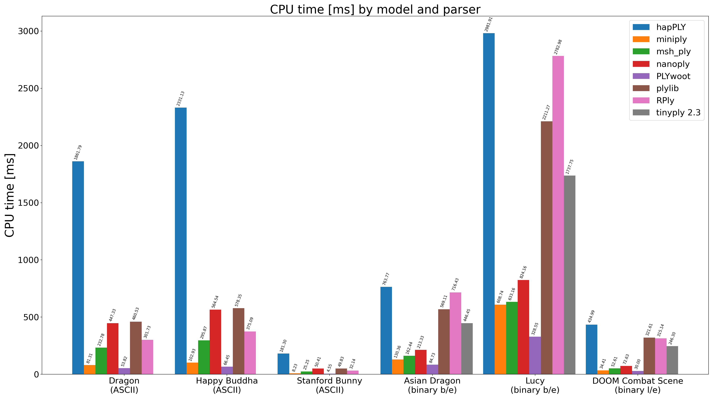

PLYbench
========

This project provides a command-line application that benchmarks parsing various 3D PLY models using different PLY parsing libraries. The benchmarks all populate a similar triangle mesh data structure. The benchmark tool uses Google Benchmark to ensure proper benchmark approach is taken.

Introduction
------------

