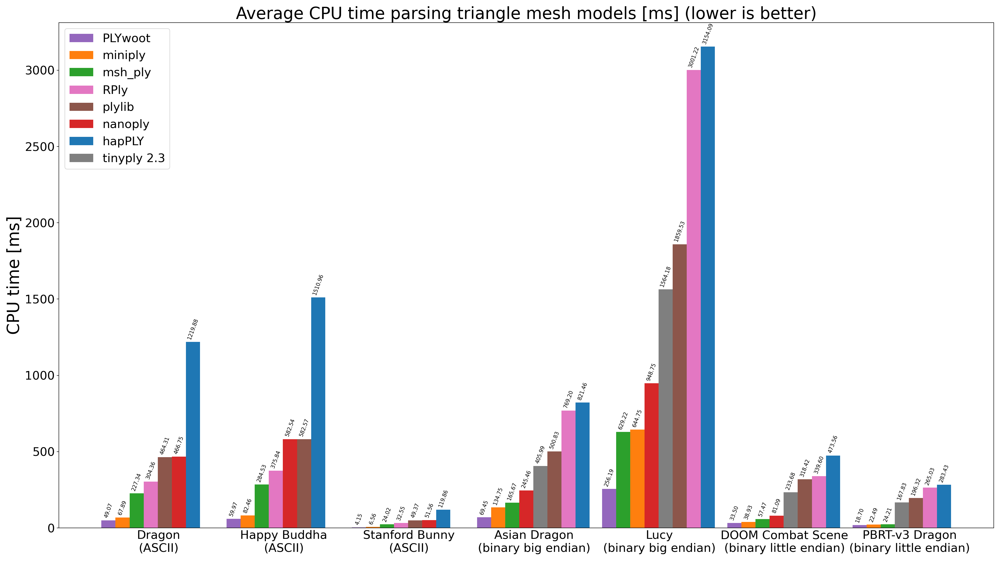
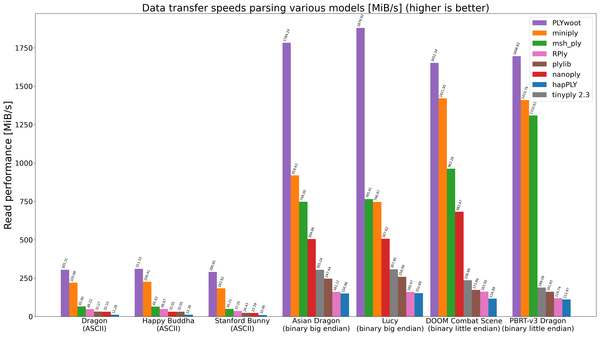
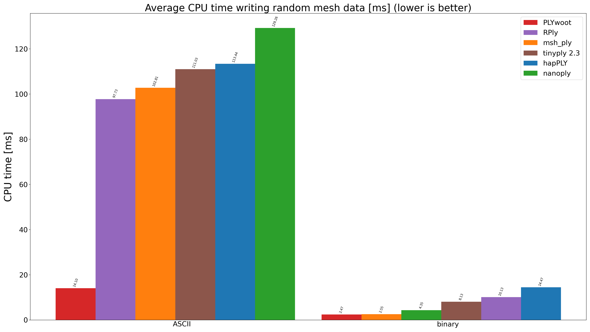

# PLYbench

This project provides a command-line application that benchmarks parsing and writing of PLY model data using different PLY parsing libraries. The benchmarks all populate a similar triangle mesh data structure. The benchmark tool uses Google Benchmark to ensure a proper benchmark approach is taken.

## Introduction

PLYbench implements two sets of benchmarks, one set benchmarks parse performance of various PLY parsing libraries using various open source PLY models. The other set of benchmarks measures how various PLY libraries stack up against each other in terms of write performance, by writing a uniform triangle mesh with a fixed number of triangles.

These benchmarks were designed with the assumption that the target language in which the parser libraries are used is C++. Hence, the triangle mesh type that is used in the benchmark uses C++ types behind the scenes. It roughly has the following form:

```cpp
#include <cstdint>
#include <vector>

struct Triangle
{
  std::int32_t a, b, c;
};

struct Vertex
{
  float x, y, z;
};

using Triangles = std::vector<Triangle>;
using Vertices = std::vector<Vertex>;

struct TriangleMesh
{
  Triangles triangles;
  Vertices vertices;
};
```

This puts some of the PLY libraries implemented in C at a slight disadvantage, since using those libraries incurs some additional overhead in the form of copying data from the C data structures into the mesh data structure. In practice, this is usually only a small part of the overall time required to parse a model.

## Benchmark results

The following results were obtained on an AMD Ryzen 5 3600 6-Core processor using a Kingston A2000 NVMe SSD. PLYbench was compiled using GCC 12.2, with optimization level `-O2`. For each PLY library, an attempt was made to implement the most efficient way to either parser or write a PLY model. Some libraries support defining known list sizes for example to speed up parsing. It may be possible though that for some of the libraries, improvements are possible; pull requests are welcome!

For more information on the models that were used, see the [Models](#models) section. For more information on the PLY libraries that were benchmarked, see the [PLY libraries](#ply-libraries) section.

### Parse benchmark results

The following lists the average relative read performance of each PLY library averaged over all models that were used in the benchmarks, per PLY format type:

| # | Library name                                                               | Overall        | ASCII          | Binary big endian | Binary little endian |
|:-:|:--------------------------------------------------------------------------:|:--------------:|:--------------:|:-----------------:|:--------------------:|
| 1 | [PLYwoot](https://github.com/ton/plywoot)                                  | *1.00*         | *1.00*         | *1.00*            | *1.00*               |
| 2 | [miniply](https://github.com/vilya/miniply)                                | 1.70x slower   | 1.51x slower   | 2.44x slower      | 1.14x slower         |
| 3 | [msh_ply](https://github.com/mhalber/msh)                                  | 3.08x slower   | 5.60x slower   | 2.38x slower      | 1.26x slower         |
| 4 | [nanoply](https://github.com/cnr-isti-vclab/vcglib/tree/main/wrap/nanoply) | 6.49x slower   | 11.64x slower  | 3.59x slower      | 4.24x slower         |
| 5 | [tinyply 2.3](https://github.com/ddiakopoulos/tinyply)                     | 7.49x slower   | N/A            | 5.90x slower      | 9.09x slower         |
| 6 | [plylib](https://github.com/cnr-isti-vclab/vcglib/tree/main/wrap/ply)      | 9.27x slower   | 10.92x slower  | 6.80x slower      | 10.08x slower        |
| 7 | [RPly](https://w3.impa.br/~diego/software/rply)                            | 10.63x slower  | 7.53x slower   | 10.80x slower     | 13.56x slower        |
| 8 | [hapPLY](https://github.com/nmwsharp/happly)                               | 17.91x slower  | 27.13x slower  | 11.73x slower     | 14.86x slower        |


The following graph plots average CPU time per model per PLY library (lower numbers are better):



The following graph plots average transfer speeds in MiB per second for parsing per model per PLY library (higher numbers are better):



Although these tests were run on a little endian machine, the transfer speeds for the models storing their data using a big endian representation achieved higher transfer speeds. This is due to the layout of the vertex data in the underlying PLY files. For the binary big endian models, parsing the data boils down to `memcpy`'ing large blocks of memory without having to stride over the data and after that do a big to little endian conversion. The binary little endian models require striding over the data in the PLY file, causing the slightly degraded performance.

### Write benchmark results

The following lists the average relative write performance of each PLY library averaged per PLY format type, note that only binary little endian is tested as a binary output format in this case:

| # | Library name                                                               | Overall        | ASCII          | Binary         |
|:-:|:--------------------------------------------------------------------------:|:--------------:|:--------------:|:--------------:|
| 1 | [PLYwoot](https://github.com/ton/plywoot)                                  | *1.00*         | *1.00*         | *1.00*         |
| 2 | [msh_ply](https://github.com/mhalber/msh)                                  | 4.09x slower   | 7.10x slower   | 1.07x slower   |
| 3 | [nanoply](https://github.com/cnr-isti-vclab/vcglib/tree/main/wrap/nanoply) | 5.39x slower   | 9.01x slower   | 1.76x slower   |
| 4 | [RPly](https://w3.impa.br/~diego/software/rply)                            | 5.41x slower   | 6.68x slower   | 4.14x slower   |
| 5 | [tinyply 2.3](https://github.com/ddiakopoulos/tinyply)                     | 5.46x slower   | 7.64x slower   | 3.28x slower   |
| 6 | [hapPLY](https://github.com/nmwsharp/happly)                               | 6.81x slower   | 7.84x slower   | 5.78x slower   |


The following graph plots average CPU time for writing a fixed triangle mesh with 100.000 semi-random triangles per PLY library (lower numbers are better):



The following graph plots average transfer speeds in MiB per second for writing per PLY format type, per PLY library (higher numbers are better):


## PLY libraries

The following PLY libraries are included in the benchmarks:

| Library name                                                               | Language | Header-only | Author                                                  |
|:--------------------------------------------------------------------------:|:--------:|:-----------:|:-------------------------------------------------------:|
| [hapPLY](https://github.com/nmwsharp/happly)                               | C++      | ✓           | [Nicolas Sharp](https://github.com/nmwsharp)            |
| [miniply](https://github.com/vilya/miniply)                                | C++      | ✓           | [Vilya Harvey](https://github.com/vilya)                |
| [msh_ply](https://github.com/mhalber/msh)                                  | C        |             | [Maciej Halber](https://github.com/mhalber)             |
| [nanoply](https://github.com/cnr-isti-vclab/vcglib/tree/main/wrap/nanoply) | C++      | ✓           | [vcglib](https://github.com/cnr-isti-vclab/vcglib)      |
| [PLYwoot](https://github.com/ton/plywoot)                                  | C++      | ✓           | [Ton van den Heuvel](https://github.com/ton)            |
| [plylib](https://github.com/cnr-isti-vclab/vcglib/tree/main/wrap/ply)      | C++      |             | [vcglib](https://github.com/cnr-isti-vclab/vcglib)      |
| [RPly](https://w3.impa.br/~diego/software/rply/)                           | C        |             | [Diego Nehab](http://w3.impa.br/~diego/index.html)      |
| [tinyply](https://github.com/ddiakopoulos/tinyply)                         | C++      | ✓           | [Dimitri Diakopoulos](https://github.com/ddiakopoulosj) |

Notes:

1. At the time of writing, tinyply 2.3 seems to have issues reading ASCII files (https://github.com/ddiakopoulos/tinyply/issues/59). Benchmarking ASCII models was therefore disabled for tinyply.
2. Miniply and plylib do not (directly) support writing PLY files, and are therefore excluded from the write benchmarks.
3. nanoply does not correctly parse the 'PBRT-v3 Dragon' model, I suspect this is because it does not properly handle the face normals being defined as part of the face element.

## Models

The following models are used in the benchmarks:

| Model name            | PLY format type      | #Vertices   | #Triangles | Source |
|:---------------------:|:--------------------:|:-----------:|:----------:|:------:|
| Stanford Bunny        | ASCII                | 35947       | 69451      | [Stanford 3D Scanning Repository](http://graphics.stanford.edu/data/3Dscanrep/)
| Dragon                | ASCII                | 437645      | 871414     | [Stanford 3D Scanning Repository](http://graphics.stanford.edu/data/3Dscanrep/)
| Happy Buddha          | ASCII                | 543652      | 1087716    | [Stanford 3D Scanning Repository](http://graphics.stanford.edu/data/3Dscanrep/)
| Lucy                  | Binary big endian    | 14027872    | 28055742   | [Stanford 3D Scanning Repository](http://graphics.stanford.edu/data/3Dscanrep/)
| Asian Dragon          | Binary big endian    | 3609600     | 7219045    | [Stanford 3D Scanning Repository](http://graphics.stanford.edu/data/3Dscanrep/)
| DOOM Combat Scene     | Binary little endian | 1612868     | 3224192    | [Artec3D](https://www.artec3d.com/3d-models/doom-combat-scene)

The PLY models are not included in the repository. Use `scripts/download_models.py` to download the models used in the benchmarks and to be able to [reproduce the benchmark results](#reproducing-the-benchmark-results).

## Reproducing the benchmark results

You can reproduce the benchmark results by building PLYbench from source. The following sections explain this in a bit more detail.

### Dependencies

To be able to build PLYbench, the following dependencies are required:

* [CMake](https://cmake.org/)
* [Ninja](https://ninja-build.org/)
* [Benchmark](https://github.com/google/benchmark)
* [PLYwoot](https://github.com/ton/plywoot)

Note that instead of Ninja a different build tool may be used (regular Make for example), but the `configure` script assumes Ninja is present on the system right now.

To be able to build the unit tests, the following dependency is required:

* [Catch2](https://github.com/catchorg/Catch2)

Note that to be able to reproduce the parse performance of PLYwoot for ASCII models, it is recommend to install the following dependencies as well:

* [fast_float](https://github.com/fastfloat/fast_float)
* [fast_int](https://github.com/ton/fast_int)

To be able to use the script that downloads the PLY input models, Python 3 is required:

* [Python 3](https://www.python.org)

Finally, to be able to render the graphs, next to Python 3, Matplotlib is required:

* [Matplotlib](https://matplotlib.org/)

### Running the benchmarks

To be able to run the benchmarks on your own PC, you will first need to download the PLY models that are used as inputs for the various benchmarks. The PLY models are not included in the repository. The `scripts/` directory contains a script to download the models though, use as follows:

```
$ scripts/download_models.py
```

This should download all models used in the benchmarks. The models will be stored in `models/`. Subsequently, after all required [dependencies](#dependencies) have been met, build PLYbench using CMake:

```
$ ./configure && ninja -C build -v
```

Finally, run the benchmarks as follows:

```
$ build/plybench --benchmark_out=benchmarks.json --benchmark_out_format=json
```

### Generating the graphs

The generated JSON file `benchmarks.json` can be used as an input for `scripts/plot_graph.py` to render various graphs. For example, to generate the the parse CPU times graph:

```
$ cat benchmarks.json | scripts/plot_graph.py -o parse_cpu_time.png -t parse_cpu_time
```

See `scripts/plot_graph.py -h` for more details.
